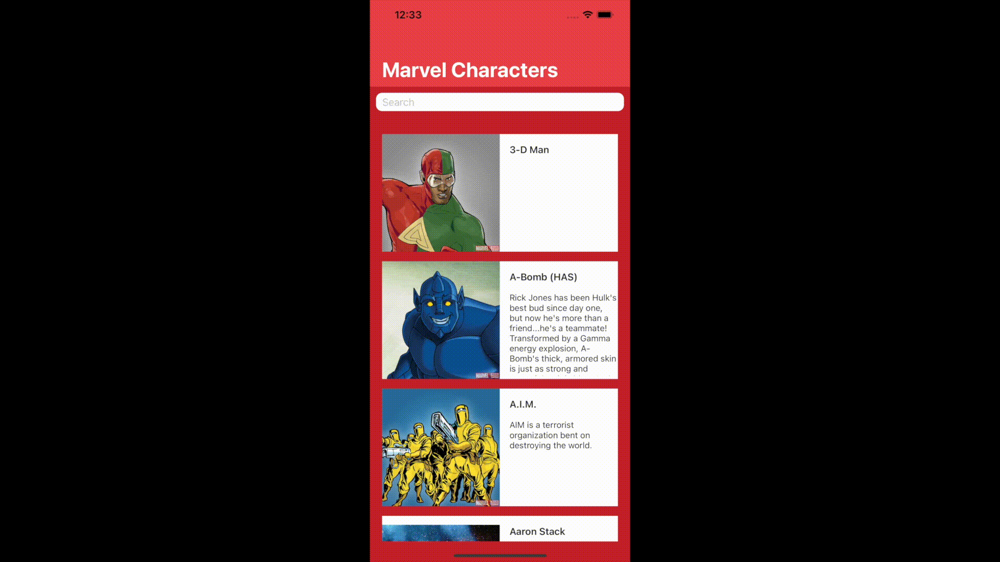
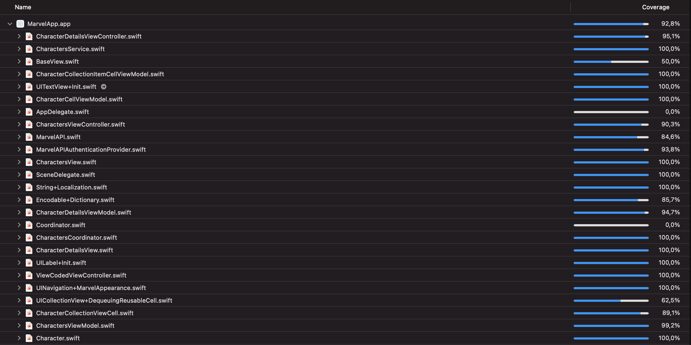

# Marvel

[](https://github.com/GabrielSilveiraa/Marvel/actions?query=workflow%3A"workflow")

## Demo 📱


## Installation 🔌

### Installing Pods
[CocoaPods](https://cocoapods.org) is a dependency manager for Cocoa projects. For usage and installation instructions, visit their website.

### Installing project's dependencies
Navigate to the root directory of this project in Terminal.

Run on terminal:
```
$ pod install
```

### Running the project
Open the .xcworkspace file and run

## Architecture 🏛

The project's architecture is MVVM-C. The MVVM presentation pattern using Coordinators to route the app.

The app is built in Features, composed by a Coordinator and Scenes.
The Coordinator is responsible for a specific flow or story, so it may be responsible for one or more Scenes.

Every Scene is developed using the MVVM presentation architecture, along with a view coded layer and a service class for any network request.

The communication between the ViewController and ViewModel is done using Combine framework and a `transform(input: Input) -> Output` pattern described [here](https://medium.com/blablacar-tech/rxswift-mvvm-66827b8b3f10) 

Every ViewController in the project inherits the `ViewCodedViewController` class, which uses a generic `BaseView` class. It's a pattern for view coding created by me and inspired by [this article](https://swiftrocks.com/writing-cleaner-view-code-by-overriding-loadview.html)


## Issues I had while developing the project 🔨

### Xcode 13.0 release 
During the project development Xcode 13.0 was released and I wanted to update the project to maintain it working with the latest xcode version. Then I had an issue with [PixelTest](https://github.com/KaneCheshire/PixelTest) framework, which it wasn't building with iOS 15. So I found this [pull request](https://github.com/KaneCheshire/PixelTest/pull/74) which fixes it and then I had appointed to this branch in my Podfile.

### Travis CI Free Plan
I used to have a free plan in Travis and have integrated this project with Travis CI. Also during development, my plan has expired. So I had to migrate my CI to Github Actions. It's working and testing the project fine. But found some limitations, which I describe in this [pull request](https://github.com/GabrielSilveiraa/Marvel/pull/8).

## Testing ✅

Unit, UI and Snapshot Tests.

### Code Coverage

- 92,8%


### Snapshot Tests 📸
As the CI's Xcode version is the 14.4, snapshot tests are ran on Iphone 12 Pro Max (iOS 14.4). If you run on some different device or iOS version it will probably fail. That's some downside to snapshot test, as it's described in PixeTest library [documentation](https://github.com/KaneCheshire/PixelTest#readme)

## Dependencies ⚙️

### Service layer

* [GMSNetworkLayer](https://github.com/GabrielSilveiraa/GMSNetworkLayer)

A framework developed by myself to facilitate the http networking in Swift.

### Image downloading and caching

* [Kingfisher](https://github.com/onevcat/Kingfisher)

### Encryption

* [Arcane](https://github.com/onmyway133/Arcane)
